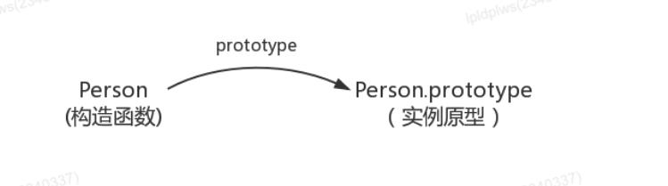
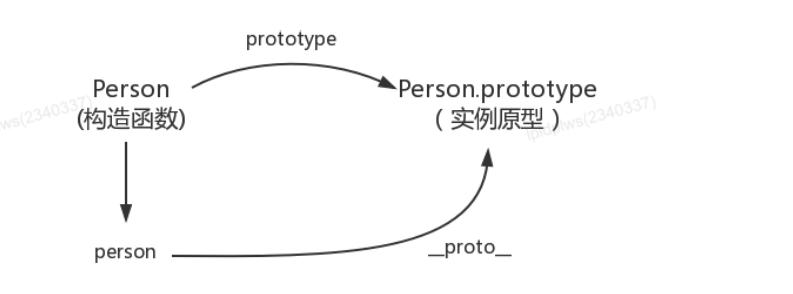
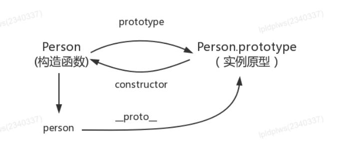
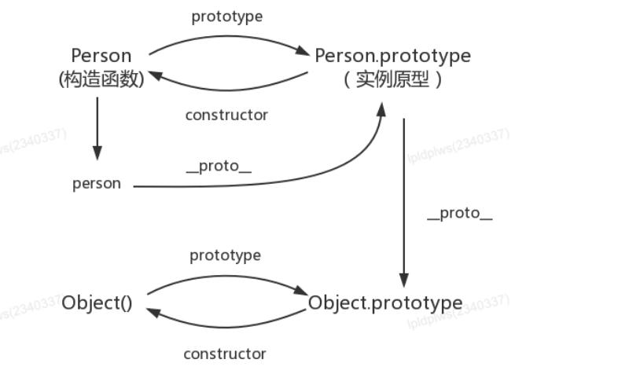
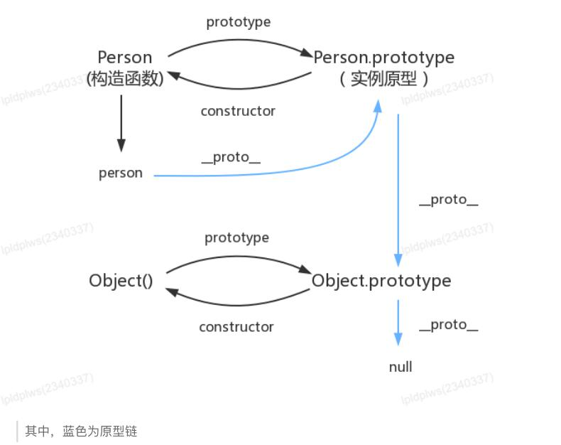
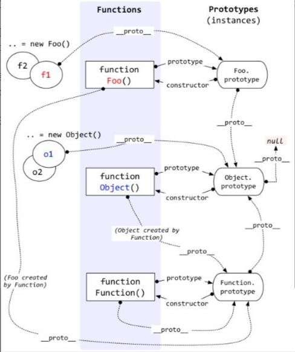
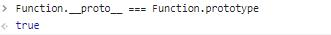
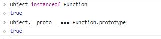
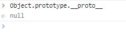

# 原型与原型链
先讲一下总结性的定义：
- 原型：原型是一个对象，是函数的一个属性prototype；通过该函数实例化出来的对象都可以继承得到原型上的所有属性和方法。原型对象默认有一个属性constructor，值为对应的构造函数；另外，有一个属性__proto__，值为Object.prototype。
- 原型链：在JavaScript中万物都是对象，对象和对象之间并不是独立存在的，对象和对象之间有一定关系。对象查找属性时现在它本身查找，找不到再通过对象__proto__属性指向函数的原型对象(函数.prototype)一层一层往上找，直到找到Object的原型对象(Object.prototype)为止，层层继承的链接结构叫做原型链（通过proto属性形成原型的链式结构,专业术语叫做原型
链）。

下面是详细解析：
## 构造函数创建对象
为了理解原型，首先我们先用构造函数创建一个对象
```js
function Person() {
}
var person = new Person();
person.name = 'linghuchong';
console.log(person.name) // linghuchong
```

在这个例子中，Person 就是一个构造函数，我们使 new 创建了一个实例对象 person。

## prototype

每个函数都有一个prototype属性，比如

```js
function Person() {
}
// 虽然写在注释里，但是你要注意：
// prototype是函数才会有的属性
Person.prototype.name = 'linghuchong';
var person1 = new Person();
var person2 = new Person();
console.log(person1.name) // linghuchong
console.log(person2.name) // linghuchong
```

那这个函数的 prototype 属性到底指向的是什么呢？是这个函数的原型吗？

其实，函数的 prototype 属性指向了一个对象，这个对象正是调用该构造函数而创建的实例的原型，也就是这个例子中的 person1 和 person2 的原型。

那什么是原型呢？你可以这样理解：每一个JavaScript对象(null除外)在创建的时候就会与之关联另一个对象，这个对象就是我们所说的原型，每一个对象都会从原型"继承"属性。

用一张图表示构造函数和实例原型之间的关系：


这里用Object.prototype 表示实例原型。
那么该怎么表示实例与实例原型，也就是 person 和 Person. prototype 之间的关系呢？

## __proto__

这是每一个JavaScript对象(除了 null )都具有的一个属性，叫 __proto__ ，这个属性会指向该对象的原型。

```js
function Person() {
}
var person = new Person();
console.log(person.__proto__ === Person.prototype); // true
```


既然实例对象和构造函数都可以指向原型，那么原型是否有属性指向构造函数或者实例呢？

## constructor
指向实例倒是没有，因为一个构造函数可以生成多个实例，但是原型指向构造函数是有的： constructor ，每个原型都有一个 constructor 属性指向关联的构造函数
```js
function Person() {
}
console.log(Person === Person.prototype.constructor); // true
```


所以，这里可以得到
```js
function Person() {
}
var person = new Person();
console.log(person.__proto__ == Person.prototype) // true
console.log(Person.prototype.constructor == Person) // true
console.log(Object.getPrototypeOf(person) === Person.prototype) // true


## 实例与原型
当读取实例的属性时，如果找不到，就会查找与对象关联的原型中的属性，如果还查不到，就去找原型的原型，一直找到最顶层为止。
举个例子：
```js
function Person() {
}
Person.prototype.name = 'linghuchong';
var person = new Person();
person.name = 'linghuchong';
console.log(person.name) // linghuchong
delete person.name;
console.log(person.name) // linghuchong
```
在这个例子中，我们给实例对象 person 添加了 name 属性，当我们打印 person.name 的时候，结果自然为 linghuchong。
但是当我们删除了 person 的 name 属性时，读取 person.name ，从 person 对象中找不到 name属性就会从 person 的原型也就是 person.__proto__ ，也就是 Person.prototype 中查找，结果为 linghuchong 。
## 原型的原型
如果在原型上还没有找到呢？原型的原型又是什么呢？
```js
var obj = new Object();
obj.name = 'linghuchong'
console.log(obj.name) // linghuchong
```
其实原型对象就是通过 Object 构造函数生成的，结合之前所讲，实例的 __proto__ 指向构造函数
的 prototype ，所以我们再更新下关系图：

## 原型链
那 Object.prototype 的原型呢？
null，我们可以打印：
```js
console.log(Object.prototype.__proto__ === null) // true
```
然而 null 究竟代表了什么呢？

所以 Object.prototype.__proto__ 的值为 null 跟 Object.prototype 没有原型，其实表达了一个意思。
所以查找属性的时候查到 Object.prototype 就可以停止查找了。
最后一张关系图也可以更新为：


# 其它

## constructor
首先是 constructor 属性：
```js
function Person() {
}
var person = new Person();
console.log(person.constructor === Person); // true
```

当获取 person.constructor 时，其实 person 中并没有 constructor 属性,当不能读取到constructor 属性时，会从 person 的原型也就是 Person.prototype 中读取，正好原型中有该属性，所以：
```js
person.constructor === Person.prototype.constructor
```
## __proto__
绝大部分浏览器都支持这个非标准的方法访问原型，然而它并不存在于 Person.prototype 中，实际上，它是来自于 Object.prototype ，与其说是一个属性，不如说是一个 getter/setter ，当使用 obj.__proto__ 时，可以理解成返回了 Object.getPrototypeOf(obj) 。
## 继承
关于继承，前面提到“每一个对象都会从原型‘继承’属性”，实际上，继承是一个十分具有迷惑性的说法，
引用《你不知道的JavaScript》中的话，就是：


# Function与Object
先上图：

上图看起来复杂，但理解了上面说的原型及原型链后，也好理解。这里讲一下图中的Function及Object相关的点：

1. 函数是由Function构造出来的，即Foo的原型（__proto__）是Function.prototype。
2. Function是内置函数，比较特殊，它的__proto__属性指向的是Function.prototype。

3. Object是内置函数，同时也可以看成是Function new出来的函数。

4. Object.prototype的原型指向null，也就是原型链的尽头。



# js为什么有原型和原型链
1. 继承
	原型和原型链提供了一种方便的形式来实现对象之间的继承关系。通过原型链，对象可以继承原型的属性和方法，从而减少了代码的冗余和重复。
2. 方法共享
	通过原型，多个对象可以共享相同的方法，从而节省内存，并提高代码的性能和效率。
3. 动态性
	JavaScript的原型和原型链允许我们在运行时动态地添加、修改和删除对象的属性和方法。这使得代码具有灵活性和可扩展性。
4. 原型链查找						当我们在一个对象上调用方法或访问属性时，如果对象本身没有该方法或属性，JavaScript会自动沿着原型链向上查找，直到找到对应的方法或到达原型链的末尾。这提供了一种灵活的机制来处理对象之间的属性和方法查找。
5. 共享内置方法
	JavaScript的内置对象（如'Array'、'String'、'Object'等）都通过原型链共享了一些通用的方法。这意味这我们可以直接在实例上调用这些方法，而不需要重复定义。
